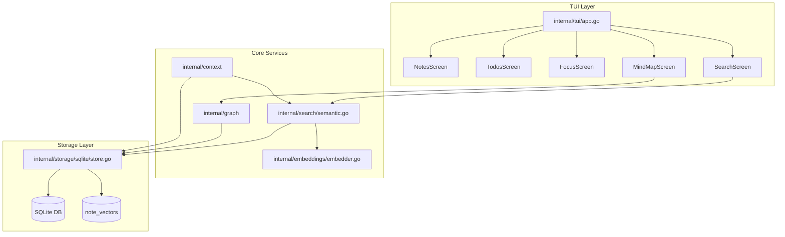

# flowState-cli

```
  ╭──────────────────────────────────────────────────────────────────╮
  │                                                                  │
  │   ███████╗██╗      ██████╗ ██╗    ██╗                            │
  │   ██╔════╝██║     ██╔═══██╗██║    ██║                            │
  │   █████╗  ██║     ██║   ██║██║ █╗ ██║                            │
  │   ██╔══╝  ██║     ██║   ██║██║███╗██║                            │
  │   ██║     ███████╗╚██████╔╝╚███╔███╔╝                            │
  │   ╚═╝     ╚══════╝ ╚═════╝  ╚══╝╚══╝                             │
  │                                                                  │
  │     ███████╗████████╗ █████╗ ████████╗███████╗                   │
  │     ██╔════╝╚══██╔══╝██╔══██╗╚══██╔══╝██╔════╝                   │
  │     ███████╗   ██║   ███████║   ██║   █████╗                     │
  │     ╚════██║   ██║   ██╔══██║   ██║   ██╔══╝                     │
  │     ███████║   ██║   ██║  ██║   ██║   ███████╗                   │
  │     ╚══════╝   ╚═╝   ╚═╝  ╚═╝   ╚═╝   ╚══════╝                   │
  │                                                                  │
  ╰──────────────────────────────────────────────────────────────────╯
```

A unified terminal productivity system for notes, todos, and focus sessions with semantic search capabilities.

## Overview

flowState-cli keeps you in the flow by making knowledge capture, task management, and focus timing instant and interconnected. Built with a clean Go codebase and a modern TUI using Bubble Tea.

## Features

### Core Features
- **Notes**: Quick capture with markdown preview, wikilinks `[[Note Title]]`, and `#hashtag` tagging
- **Todos**: Task management with priorities, due dates, status badges, and multiple sort/filter modes
- **Focus Sessions**: Pomodoro-style timer with configurable durations, session history, and streak tracking
- **Linking System**: Connect notes and todos through bidirectional relationships
- **Mind Map**: Visual graph of your notes and their connections
- **Semantic Search**: Local ONNX-powered semantic search with embeddings

### UX Enhancements
- **Quick Capture**: `Ctrl+X` to instantly capture a thought from anywhere
- **Context-Sensitive Help**: Press `?` for detailed help in Links and Mind Map screens
- **Smart Duration Picker**: Arrow keys auto-save and auto-exit after selection
- **Clean Edit Mode**: Title label hides when editing body for distraction-free writing
- **Multiline Notes**: Enter key creates new lines in note body (Ctrl+S to save)

## Architecture



## Tech Stack

- **TUI Framework**: Bubble Tea + Lip Gloss + Bubbles
- **Structured Storage**: SQLite (pure Go via modernc.org/sqlite)
- **Vector Storage**: SQLite-backed vectors (`note_vectors`)
- **Embeddings**: Local model file management in place (ONNX inference wiring is the next step)
- **Local Only**: No cloud dependencies, privacy-first

## Quick Start

### Installation

#### Option A: npm (recommended)

```bash
npm install -g flowstate-cli
flowstate
```

#### Option B: Download binary

Download from [GitHub Releases](https://github.com/Jericoz-JC/flowState-CLI/releases/latest):

| Platform | File |
|----------|------|
| Windows | `flowstate-windows-amd64.zip` |
| macOS (Intel) | `flowstate-darwin-amd64.tar.gz` |
| macOS (Apple Silicon) | `flowstate-darwin-arm64.tar.gz` |
| Linux | `flowstate-linux-amd64.tar.gz` |

Extract and run:
- macOS/Linux: `./flowstate`
- Windows: `.\flowstate.exe`

#### Option C: Go install

```bash
go install github.com/Jericoz-JC/flowState-CLI/cmd/flowState@latest
```

#### Option D: Build from source

```bash
git clone https://github.com/Jericoz-JC/flowState-CLI
cd flowState-CLI
go build -o flowstate ./cmd/flowState
./flowstate
```

### First Run

On first run, the application will:
1. Initialize SQLite database
2. Download the embedding model (~90MB)
3. Start the TUI interface

### Keyboard Shortcuts

#### Global Navigation
| Key | Action |
|-----|--------|
| `Ctrl+X` | Quick capture note (from anywhere) |
| `Ctrl+N` | Notes screen |
| `Ctrl+T` | Todos screen |
| `Ctrl+F` | Focus session screen |
| `Ctrl+/` | Semantic search screen |
| `Ctrl+G` | Mind map screen |
| `Ctrl+L` | Link selected item |
| `Ctrl+H` | Home screen / Help |
| `?` | Shortcut help modal |
| `Esc` | Go back / Cancel |
| `q` | Quit application |

#### Notes Screen
| Key | Action |
|-----|--------|
| `c` | Create new note |
| `e` | Edit selected note |
| `p` | Preview note (read-only markdown view) |
| `d` | Delete selected note (with confirmation) |
| `/` | Open search filter |
| `s` | Cycle sort mode (Date↓ → Title → Date↑) |
| `t` | Filter by tag |
| `Ctrl+R` | Reset all filters |
| `Ctrl+L` | Open linking modal |
| `j/↓` | Move selection down |
| `k/↑` | Move selection up |

#### Notes Edit Mode
| Key | Action |
|-----|--------|
| `Tab` | Switch between title and body fields |
| `Enter` | Save (when in title) / New line (when in body) |
| `Ctrl+S` | Save note |
| `Ctrl+E` | Toggle markdown preview |
| `Ctrl+B` | Bold text |
| `Ctrl+I` | Italic text |
| `Esc` | Cancel and return to list |

#### Todos Screen
| Key | Action |
|-----|--------|
| `c` | Create new todo |
| `e` | Edit selected todo |
| `v` | Preview todo details |
| `d` | Delete selected todo (with confirmation) |
| `Space` | Toggle todo completion |
| `/` | Open search filter |
| `s` | Cycle sort mode (Date↓ → Priority → Date↑ → A-Z → Due Date) |
| `p` | Cycle priority filter (All → High → Medium → Low) |
| `t` | Filter by tag |
| `Ctrl+R` | Reset all filters |
| `Ctrl+L` | Open linking modal |
| `j/↓` | Move selection down |
| `k/↑` | Move selection up |

#### Linking Modal
| Key | Action |
|-----|--------|
| `c` | Create new link |
| `d` | Delete selected link |
| `?` | Show help |
| `↑/↓` | Navigate link types or targets |
| `Enter` | Select / Confirm |
| `Esc` | Close modal / Go back |

#### Mind Map Screen
| Key | Action |
|-----|--------|
| `h/j/k/l` | Navigate nodes |
| `+/-` | Zoom in/out |
| `Enter` | Open selected note |
| `?` | Show help |
| `Esc` | Return to notes |

#### Focus Sessions Screen
| Key | Action |
|-----|--------|
| `s` | Start timer (or resume if paused) |
| `p` | Pause timer |
| `c` | Cancel current session |
| `b` | Skip to break / Skip break |
| `d` | Change work/break duration |
| `h` | Toggle history view |
| `Esc` | Return to idle / Cancel action |

#### Duration Picker (press `d` to open)
| Key | Action |
|-----|--------|
| `←/→` | Adjust duration (auto-saves and auto-exits after 500ms) |
| `Tab` | Switch between work/break duration |
| `Enter` | Done - exit immediately |
| `Esc` | Cancel and exit |

> **Tip**: Just press `d`, use arrow keys to select your duration, and the picker closes automatically!

## Releasing (maintainers)

### Prerequisites
- [GoReleaser](https://goreleaser.com/) installed
- `GITHUB_TOKEN` environment variable set with repo permissions
- npm account with publish access to `flowstate-cli`

### Release Steps

```bash
# 1) Update version in npm/package.json (must match the tag version)
# Edit npm/package.json and change "version": "X.Y.Z"

# 2) Commit and push all changes
git add .
git commit -m "Prepare for vX.Y.Z release"
git push origin main

# 3) Create and push the tag
git tag -a vX.Y.Z -m "Release description"
git push origin vX.Y.Z

# 4) Build binaries and create GitHub Release (requires GITHUB_TOKEN)
goreleaser release --clean

# 5) Publish to npm (after GitHub release is complete)
cd npm
npm publish
```

### Important Notes
- The npm package version in `npm/package.json` **must match** the git tag version
- GitHub release must be complete before `npm publish` (binaries must be downloadable)
- The npm `postinstall` script downloads binaries from GitHub releases
- Test the npm package locally before publishing: `npm pack && npm install -g flowstate-cli-X.Y.Z.tgz`

### Troubleshooting npm Installation
If users report 404 errors during `npm install`:
1. Verify the GitHub release exists at `https://github.com/Jericoz-JC/flowState-CLI/releases/tag/vX.Y.Z`
2. Check that all 6 platform binaries are uploaded (darwin-amd64, darwin-arm64, linux-amd64, linux-arm64, windows-amd64, windows-arm64)
3. Ensure npm package version matches the release tag exactly

## Project Structure

```
flowState-cli/
├── cmd/
│   └── flowState/
│       └── main.go                    # Entry point
├── internal/
│   ├── config/
│   │   └── config.go                  # Configuration management
│   ├── models/
│   │   ├── note.go                    # Note data structure
│   │   ├── todo.go                    # Todo data structure
│   │   ├── session.go                 # Focus session structure
│   │   └── link.go                    # Linking relationships
│   ├── storage/
│   │   ├── sqlite/
│   │   │   └── store.go               # SQLite operations
│   │   └── qdrant/
│   │       └── vector_store.go        # Qdrant vector operations
│   ├── embeddings/
│   │   └── embedder.go                # ONNX embedding service
│   ├── search/
│   │   └── semantic.go                # Semantic search logic
│   ├── tui/
│   │   ├── app.go                     # Main TUI application
│   │   ├── screens/
│   │   │   ├── notes.go               # Notes screen
│   │   │   ├── todos.go               # Todos screen
│   │   │   ├── focus.go               # Focus session screen
│   │   │   └── search.go              # Search results screen
│   │   ├── components/
│   │   │   ├── list.go                # Reusable list component
│   │   │   ├── editor.go              # Text editor component
│   │   │   ├── tag_input.go           # Tag input component
│   │   │   └── timer.go               # Focus timer component
│   │   └── styles/
│   │       └── theme.go               # Lip Gloss styling
│   └── commands/
│       └── cmd.go                     # Bubble Tea command wrappers
├── embeddings/
│   └── models/
│       └── README.md                  # Model download instructions
├── migrations/
│   └── 001_initial.sql                # SQLite schema
├── go.mod
├── go.sum
└── README.md
```

## Database Schema

```sql
-- Notes table
CREATE TABLE notes (
    id INTEGER PRIMARY KEY,
    title TEXT NOT NULL,
    body TEXT,
    tags TEXT, -- JSON array
    created_at DATETIME DEFAULT CURRENT_TIMESTAMP,
    updated_at DATETIME DEFAULT CURRENT_TIMESTAMP
);

-- Todos table
CREATE TABLE todos (
    id INTEGER PRIMARY KEY,
    title TEXT NOT NULL,
    description TEXT,
    status TEXT DEFAULT 'pending', -- pending, in_progress, completed
    priority INTEGER DEFAULT 0,
    due_date DATETIME,
    note_id INTEGER REFERENCES notes(id),
    created_at DATETIME DEFAULT CURRENT_TIMESTAMP,
    updated_at DATETIME DEFAULT CURRENT_TIMESTAMP
);

-- Focus sessions table
CREATE TABLE sessions (
    id INTEGER PRIMARY KEY,
    start_time DATETIME,
    end_time DATETIME,
    duration INTEGER, -- in seconds
    status TEXT, -- running, completed, cancelled
    created_at DATETIME DEFAULT CURRENT_TIMESTAMP
);

-- Links table
CREATE TABLE links (
    id INTEGER PRIMARY KEY,
    source_type TEXT NOT NULL, -- 'note' or 'todo'
    source_id INTEGER NOT NULL,
    target_type TEXT NOT NULL,
    target_id INTEGER NOT NULL,
    link_type TEXT, -- 'related', 'contains', 'references'
    created_at DATETIME DEFAULT CURRENT_TIMESTAMP,
    UNIQUE(source_type, source_id, target_type, target_id)
);

-- Note vectors table (semantic search)
CREATE TABLE note_vectors (
    note_id INTEGER PRIMARY KEY REFERENCES notes(id) ON DELETE CASCADE,
    embedding BLOB NOT NULL,
    updated_at DATETIME DEFAULT CURRENT_TIMESTAMP
);

-- Indexes
CREATE INDEX idx_notes_tags ON notes(tags);
CREATE INDEX idx_todos_status ON todos(status);
CREATE INDEX idx_todos_note_id ON todos(note_id);
CREATE INDEX idx_links_source ON links(source_type, source_id);
CREATE INDEX idx_links_target ON links(target_type, target_id);
```

## Semantic Search

The application uses `all-MiniLM-L6-v2` embedding model for semantic search:

- **Model size**: ~90MB (downloaded on first run)
- **Dimensions**: 384
- **Storage**: SQLite-backed vectors (`note_vectors` table)
- **Features**: Natural language queries, tag filtering, incremental indexing
- **Privacy**: 100% local - no cloud dependencies

## Requirements

- **OS**: Windows 10+, Linux, macOS 11+
- **RAM**: 512MB free (embedding model ~100MB)
- **Storage**: 200MB for app + models
- **Go**: 1.21+

## Development

```bash
# Install dependencies
go mod download

# Run tests
go test ./...

# Build
go build -o flowState ./cmd/flowState/

# Run with hot reload (requires air)
air
```

## Notes on ONNX (Local Embeddings)

- The repo now includes **local model file management** (download/ensure) for an ONNX `model.onnx` under your configured `ModelPath`.
- **Current behavior**: embeddings are still generated by a deterministic placeholder embedder (384-dim) to keep builds simple and fully pure-Go.
- **Next step**: wire real ONNX inference + tokenization into `internal/embeddings/embedder.go` and switch `Embed()` to use it when the model is present.

## License

MIT License - see LICENSE file for details.

## Acknowledgments

- [Bubble Tea](https://github.com/charmbracelet/bubbletea) for the excellent TUI framework
- [ONNX Runtime](https://onnxruntime.ai/) for cross-platform ML inference
